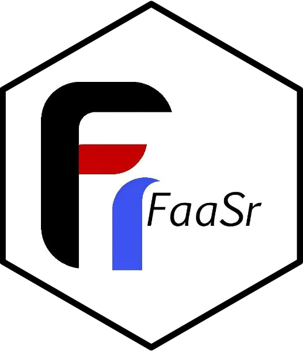

<!-- README.md is generated from README.Rmd. Please edit that file -->

# FaaSr 

[](https://github.com/FaaSr/FaaSr-package-v2/actions/workflows/R-CMD-check.yaml)
[](https://cran.r-project.org/package=FaaSr)
[](https://doi.org/10.21105/joss.07027)

Start here to learn about FaaSr, especially if you used the
previous version of the FaaSr package before.

## Introduction

FaaSr is a completely new local execution system. In this
article we highlight the differences between the old and the new system.

There are two ways to use FaaSr. The recommended way for development and
testing is to use `faasr_test()` from this package to run your FaaSr
workflows locally on your own machine — no cloud credentials or accounts
required.

When you are ready to deploy to production, use
[FaaSr-Backend](https://github.com/FaaSr/FaaSr-Backend), which handles
execution across GitHub Actions, AWS Lambda, OpenWhisk, Google Cloud,
and SLURM. For more information, visit <https://faasr.io>.

## Transitioning from FaaSr v1

### Requirements for using FaaSr

First, you need R (>= 3.5.0) installed on your machine.

Second, you need a project directory containing your workflow JSON file
and your R function scripts.

Third, install FaaSr:

``` r
# install.packages("devtools")
devtools::install_github("FaaSr/FaaSr-package-v2")
```

Call `faasr_test("path/to/workflow.json")` from your project directory
to run your workflow locally. FaaSr automatically creates a
`faasr_data/` directory to simulate cloud infrastructure.

### Differences from FaaSr v1

The production execution backend — cloud deployment, S3 operations, and
FaaS platform triggers — has moved to
[FaaSr-Backend](https://github.com/FaaSr/FaaSr-Backend). This package
now focuses exclusively on local testing.

- The JSON schema is always fetched fresh from FaaSr-Backend at
  runtime, so your local workflows are validated against the latest
  specification.
- You do not need cloud credentials or S3 buckets for local testing.
  File operations are simulated on your local filesystem under
  `faasr_data/files/`.
- Logs are written to `faasr_data/logs/` instead of a remote S3
  bucket.
- The cloud-invocation functions from v1 are not part of this package —
  use FaaSr-Backend for production deployments.
- More workflow features are now validated locally: conditional
  branching (True/False paths), parallel rank execution, cycle
  detection, and predecessor consistency.

## Local Testing

### Project Structure

FaaSr creates a `faasr_data/` directory automatically to
simulate cloud infrastructure:

``` r
library(FaaSr)

# Directory structure (created automatically by faasr_test()):
# your-project/
# ├── workflow.json              # Your FaaSr workflow configuration
# ├── faasr_data/                # Created automatically
# │   ├── functions/             # (Optional) User R functions
# │   ├── files/                 # Simulated S3 storage
# │   ├── logs/                  # Log files
# │   └── temp/                  # Temporary execution files
# └── my_functions.R             # (Optional) Your R functions
```

### Running a Workflow

Set your working directory to your project and call:

``` r
faasr_test("path/to/workflow.json")
```

Your workflow runs locally with full support for:

- Conditional branching (True/False paths)
- Parallel rank execution
- File operations (simulated S3 via local filesystem)
- Logging and monitoring

### Limitations of Local Testing

Local testing with `faasr_test()` does not connect to any cloud
infrastructure — all storage operations use the local filesystem. This
means:

- Results are not persisted to S3 or any remote storage between runs.
- No actual FaaS platform (Lambda, OpenWhisk, etc.) is invoked;
  functions run sequentially in the same R session.
- Network-dependent features such as remote triggers and cloud
  notifications are not exercised.

To deploy against real cloud infrastructure, use
[FaaSr-Backend](https://github.com/FaaSr/FaaSr-Backend).

## Production Deployment

Once your workflow is validated locally, deploy it to the cloud using
[FaaSr-Backend](https://github.com/FaaSr/FaaSr-Backend), which supports
GitHub Actions, AWS Lambda, OpenWhisk, Google Cloud, and SLURM.

For more information, visit <https://faasr.io>.
